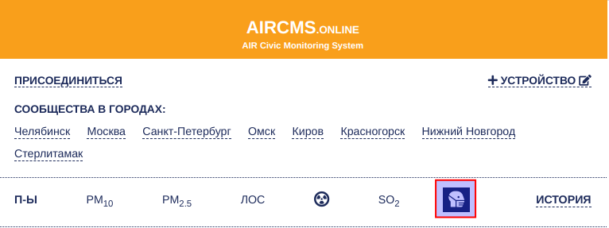
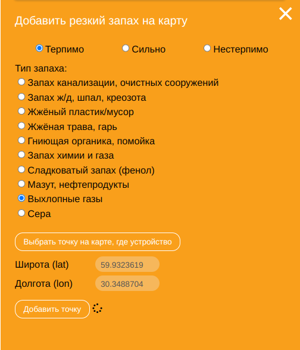

# Что это?

Это инструкция, как подавать данные о плохих запахах.

# Для кого это?

Для неравнодушных граждан и экоактивистов, которые заботятся о своём здоровье и окружающей природе.

# Зачем отправлять данные?

* Эти данные используются для анализа и сопоставления с данными о микрочастицах, а также для обнаружения загрязнителей и влияние на них официальными методами.
* Это участие в гражданской науке, которое не требует много времени, но приносит пользу учёным. Например, статистика выбросов может показать связи с заболеваниями.

# Как поставить отметку о неприятном запахе на карте

* Авторизуйтесь в [этом боте](https://t.me/AircmsOnlineBot): https://t.me/AircmsOnlineBot;
* Перейдите по полученной от бота ссылке;
* Слева в меню кликните по человечку в маске (выделен красным прямоугольником);

* Справа внизу на карте будут иконки меню, как показано на картинке ниже;

* Нажмите на + в верхней части меню (выделен красным кружком);

* Откроется следующее меню:

* Выберите пункты согласно своим ощущениям. Например, как показано на картинке "Терпимо" и "Выхлопные газы".
* Нажмите на "Выбрать точку на карте, где устройство" (или введите точные координаты, если они вам известны). Меню закроется, и вы сможете указать место на карте. После этого меню откроется снова;
* Теперь нажмите на "Добавить точку". Всё, данные отправлены!

# Ссылки

* [AIRCMS.online](https://aircms.online/#/)
* [Гражданская наука в России](https://citizenscience.ru)

Распространяется под лицензией [CC BY-NC-SA](https://ru.wikipedia.org/wiki/%D0%9B%D0%B8%D1%86%D0%B5%D0%BD%D0%B7%D0%B8%D0%B8_%D0%B8_%D0%B8%D0%BD%D1%81%D1%82%D1%80%D1%83%D0%BC%D0%B5%D0%BD%D1%82%D1%8B_Creative_Commons)
